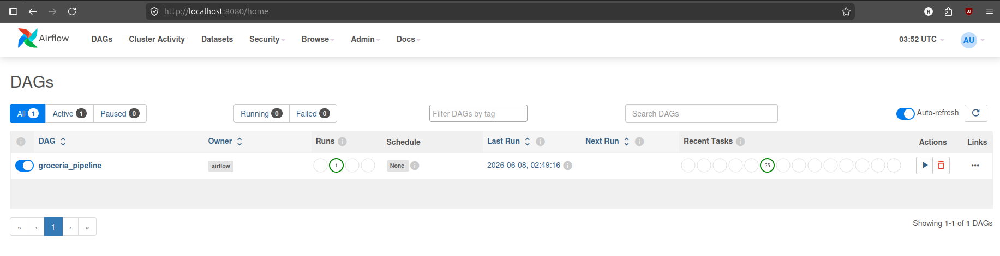

# DustiniaDelixia Groceria — Data Pipeline

---

## Bahasa Indonesia 

---

## Struktur Repositori

Repositori ini mengimplementasikan pipeline data end-to-end yang dibangun di atas arsitektur medallion 4 layer. Direktori `clickhouse/` berisi skrip DDL yang menginisialisasi empat database ClickHouse: `raw`, `ods`, `dwh`, dan `mart`, masing-masing merepresentasikan tahap pengolahan data yang berbeda, mulai dari mengekstrak data mentah hingga tabel mart yang siap untuk analisis.

Logika pemrosesan data diletakkan dalam `spark_jobs/`, yang terstruktur berdasarkan tahap pipeline. Setiap subdirektori disesuaikan dengan layer data yang dihasilkan oleh tahapan tersebut.  `ingest/` menangani pemuatan CSV ke raw, `transform/` menjalankan pembersihan data dan derivasi hingga membentuk ODS, `build/` membuat tabel fakta dan dimensi star schema, dan `mart/` menghasilkan tabel agregat yang dioptimalkan untuk keperluan BI.

Orkestrasi ditangani oleh Apache Airflow yang didefinisikan dalam `dags/`. DAG mengurutkan seluruh Spark job dari ekstrak data raw hingga pengisian database mart, menggunakan `BashOperator` untuk memanggil setiap job sesuai urutan.

---

## Arsitektur Pipeline

Pipeline ini diorkestrasikan oleh Apache Airflow, yang mendefinisikan dan mengurutkan seluruh task melalui satu DAG yang akan menentukan urutan eksekusi dari ekstraksi data hingga pengisian database mart. Apache Spark berperan sebagai engine transform, menangani seluruh pemrosesan data meliputi pembersihan, casting tipe data, derivasi kolom, dan agregasi di setiap layer.

**Raw**: Data mentah diekstrak langsung dari file CSV ke ClickHouse dengan perubahan minimal. Seluruh kolom disimpan sebagai `Nullable(String)` untuk mempertahankan data sumber apa adanya. Setelah diekstrak, pemeriksaan kualitas data dilakukan mencakup jumlah baris, persentase null, deteksi duplikat, dan integritas referensial sebelum transformasi apa pun dimulai.

**ODS**: layer ODS menerima data dari raw dan menerapkan pembersihan serta casting tipe data. Deduplikasi, penghapusan nilai null, dan derivasi kolom dilakukan di sini, menghasilkan data yang sudah bertipe dan tervalidasi.

**DWH**: layer DWH mengagregasi dan menggabungkan tabel-tabel ODS ke dalam star schema, membangun tabel dimensi (`dim_customer`, `dim_date`, `dim_payment_method`) dan tabel fakta (`fact_orders`, `fact_payments`) yang merepresentasikan makna bisnis. Hanya tabel yang relevan dengan persona Finance yang digunakan, yakni orders, orders_item, payments, customers, dan geolocation.

**Mart**: layer mart melakukan pra-agregasi data DWH ke dalam empat tabel analitik yang dirancang khusus, masing-masing menjawab pertanyaan bisnis spesifik dari perspektif Finance. Metabase terhubung langsung ke layer mart untuk menyajikan dashboard tanpa memerlukan join atau agregasi kompleks pada saat query dijalankan.

---

## Cara Menjalankan

### Persiapan Dataset

Folder `datasets/` tidak disertakan dalam repositori ini. Dataset yang digunakan dapat diunduh dari [https://its.id/m/Dataset_FP_MCI](https://its.id/m/Dataset_FP_MCI) kemudian ditempatkan di dalam folder `datasets/` sebelum menjalankan pipeline.

### Langkah-langkah

```bash
# 1. Build image
docker compose build

# 2. Inisialisasi Airflow
docker compose up airflow-init

# 3. Jalankan seluruh service
docker compose up -d
```

Setelah seluruh service berjalan, buka Airflow UI di [http://localhost:8080](http://localhost:8080) dan trigger DAG `groceria_pipeline` secara manual.

<p align="center">
  
</p>
---

## English

## Repository Structure

This repository implements an end-to-end data pipeline built on a 4-layer medallion architecture. The `clickhouse/` directory contains DDL scripts that initialize four ClickHouse databases: `raw`, `ods`, `dwh`, and `mart`, each representing a distinct stage of data refinement, from raw ingestion through analytical-ready mart tables.

Data processing logic is encapsulated in `spark_jobs/`, structured by pipeline stage. Each subdirectory corresponds to a layer transition: `ingest/` handles CSV-to-raw loading, `transform/` executes ODS cleaning and derivation, `build/` builds the star schema facts and dimensions, and `mart/` produces aggregated tables optimized for BI querying.

Orchestration is handled by Apache Airflow, defined in `dags/`. The DAG sequences all Spark jobs end-to-end, from raw ingestion through mart population, using `BashOperator` to invoke each `spark-submit` job in the correct dependency order.

---

## Architecture Overview

The pipeline is orchestrated by Apache Airflow, which defines and sequences all tasks through a single DAG — dictating execution order from ingestion through mart population. Apache Spark serves as the transformation engine, handling all data processing including cleaning, type casting, derivations, and aggregations across every layer transition.

**Raw**: Raw data is ingested directly from CSV files into ClickHouse with minimal transformation. All columns are stored as `Nullable(String)` to preserve the source data as-is. Following ingestion, a data quality check is performed covering row counts, null rates, duplicate detection, and referential integrity before any transformation begins.

**ODS**: The ODS layer receives data from raw and applies cleaning and type casting. Deduplication, null removal, and column derivations are performed here, producing typed, validated records ready for analytical use.

**DWH**: The DWH layer aggregates and joins ODS tables into a star schema, constructing dimension tables (`dim_customer`, `dim_date`, `dim_payment_method`) and fact tables (`fact_orders`, `fact_payments`) that carry business meaning. Only tables relevant to the Finance persona are carried forward — orders, payments, customers, and geolocation.

**Mart**: The mart layer pre-aggregates DWH data into four purpose-built analytical tables, each answering a specific Finance question. Metabase connects directly to the mart layer to serve dashboards without requiring complex joins or aggregations at query time.

---

## How to Run

### Prerequisites

Docker and Docker Compose installed on your machine.

### Dataset Setup

The `datasets/` folder is not included in the repository. Download the dataset from [https://its.id/m/Dataset_FP_MCI](https://its.id/m/Dataset_FP_MCI) and place all CSV files inside the `datasets/` folder before running the pipeline.

### Steps

```bash
# 1. Build the images
docker compose build

# 2. Initialize Airflow
docker compose up airflow-init

# 3. Start all services
docker compose up -d
```

Once all services are running, open the Airflow UI at [http://localhost:8080](http://localhost:8080) and manually trigger the `groceria_pipeline` DAG.

<p align="center">
  
</p>